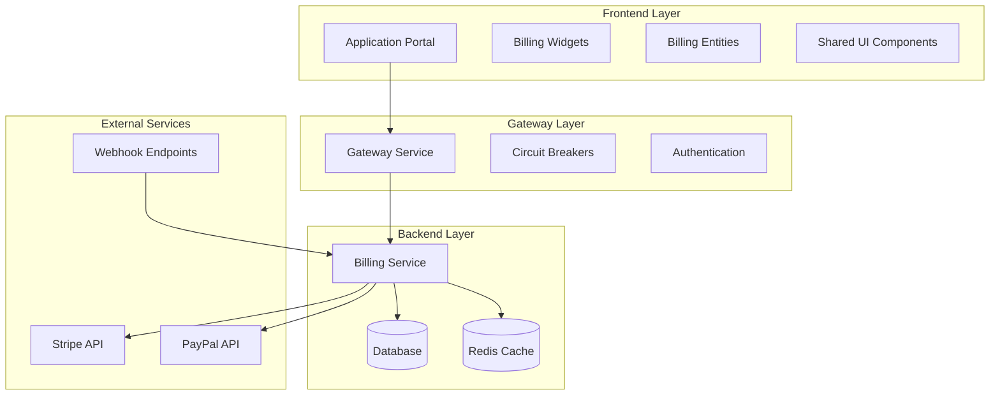
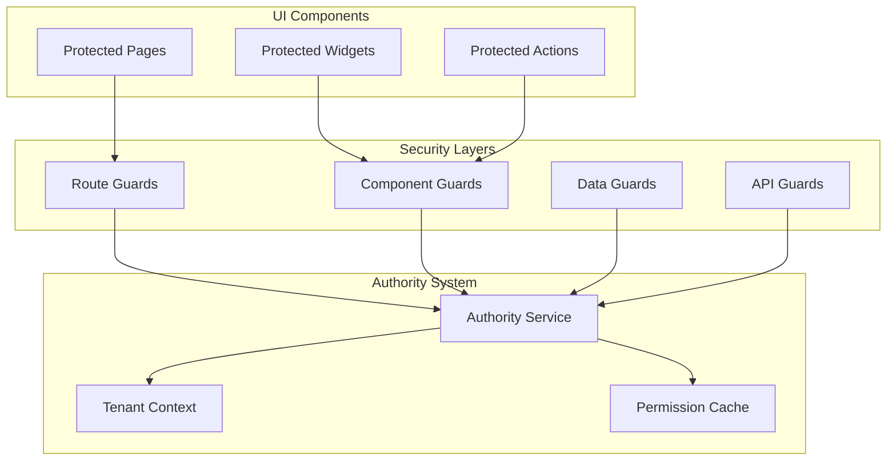

# Subscription and Billing Feature Design

## Overview

The Subscription and Billing feature integrates the existing backend billing service with the frontend application portal to provide comprehensive SaaS monetization capabilities. The design follows Feature-Sliced Design (FSD) architecture principles, leverages Mantine UI components, and implements role-based access control with full internationalization support.

The system handles subscription lifecycle management, payment processing, usage tracking, quota enforcement, and customer self-service through a multi-tenant architecture with real-time synchronization between frontend and backend services.

## Architecture

### High-Level Architecture



### FSD Layer Organization

```
src/
├── app/                    # Application configuration
├── pages/                  # Route-level components
├── widgets/               # Composite UI blocks
│   ├── subscription-card/
│   ├── billing-dashboard/
│   ├── payment-methods/
│   └── usage-metrics/
├── features/              # Business features
│   ├── subscription-management/
│   ├── payment-processing/
│   ├── quota-enforcement/
│   └── invoice-management/
├── entities/              # Business entities
│   ├── subscription/
│   ├── invoice/
│   ├── payment-method/
│   └── usage-metric/
└── shared/               # Shared resources
    ├── ui/               # Reusable components
    ├── api/              # API clients
    ├── lib/              # Utilities
    └── locales/          # I18n resources
```

## Fine-Granular Dashboard Architecture

### Dashboard Composition Strategy

#### Micro-Dashboard Approach

The billing system implements a micro-dashboard architecture where complex dashboards are composed of smaller, focused dashboard components that can be independently developed, tested, and reused.

#### Dashboard Hierarchy

```
Main Billing Dashboard
├── Executive Summary Dashboard
│   ├── Revenue Overview Widget
│   ├── Key Metrics Cards
│   └── Trend Indicators
├── Operational Dashboard
│   ├── Subscription Management Panel
│   ├── Payment Processing Monitor
│   └── Usage Analytics Grid
└── Customer Dashboard
    ├── Subscription Status Widget
    ├── Usage Meters
    └── Billing History Table
```

### Modern Data Organization Patterns

#### Data Layer Architecture

- **Repository Pattern**: Centralized data access with caching and error handling
- **Query Builders**: Type-safe query construction for complex filtering
- **Data Transformers**: Consistent data normalization and formatting
- **Real-time Adapters**: WebSocket integration for live dashboard updates

#### State Management Patterns

- **Domain-Driven State**: State organized by business domains (billing, subscriptions, payments)
- **Computed Selectors**: Memoized data derivations for dashboard metrics
- **Optimistic Updates**: Immediate UI feedback with server reconciliation
- **Temporal State**: Time-travel debugging and state history for analytics

### Dashboard Customization Framework

#### User-Configurable Dashboards

- **Drag-and-Drop Builder**: Visual dashboard composition interface
- **Widget Marketplace**: Library of pre-built and custom widgets
- **Layout Templates**: Predefined dashboard layouts for different roles
- **Responsive Breakpoints**: Automatic layout adaptation for different screen sizes

#### Personalization Features

- **Saved Views**: User-specific dashboard configurations
- **Custom Filters**: Persistent filter preferences
- **Alert Thresholds**: Personalized notification settings
- **Export Preferences**: Customizable report generation

## Code Reuse and Abstraction Strategy

### Shared Abstraction Layers

#### Business-Focused Component Architecture

Components are designed for specific business purposes rather than generic abstractions:

```typescript
// Concrete business components for specific use cases
interface BillingDashboardProps {
  tenantId: string;
  subscriptions: Subscription[];
  currentUsage: UsageMetric[];
  recentInvoices: Invoice[];
}

const BillingDashboard: React.FC<BillingDashboardProps> = ({
  tenantId,
  subscriptions,
  currentUsage,
  recentInvoices
}) => {
  // Specific business logic for billing dashboard
  const activeSubscription = subscriptions.find(s => s.status === 'active');
  const usageWarnings = currentUsage.filter(u => u.percentage > 90);
  const overdueInvoices = recentInvoices.filter(i => i.status === 'overdue');

  return (
    <div className="billing-dashboard">
      <SubscriptionStatusSection subscription={activeSubscription} />
      <UsageAlertsSection warnings={usageWarnings} />
      <OverdueInvoicesSection invoices={overdueInvoices} />
      <QuickActionsSection tenantId={tenantId} />
    </div>
  );
};
```

#### Business-Specific Data Hooks

Purpose-built hooks for specific billing business logic:

```typescript
// Specific hook for subscription management page
const useSubscriptionManagement = (tenantId: string) => {
  const { data: subscription, loading: subscriptionLoading } = useQuery({
    queryKey: ["subscription", tenantId],
    queryFn: () => fetchActiveSubscription(tenantId),
  });

  const { data: availablePlans } = useQuery({
    queryKey: ["plans", subscription?.planId],
    queryFn: () => fetchUpgradeOptions(subscription?.planId),
    enabled: !!subscription,
  });

  const upgradeMutation = useMutation({
    mutationFn: (planId: string) => upgradeSubscription(tenantId, planId),
    onSuccess: () => queryClient.invalidateQueries(["subscription", tenantId]),
  });

  return {
    subscription,
    availablePlans,
    isLoading: subscriptionLoading,
    upgradeSubscription: upgradeMutation.mutate,
    isUpgrading: upgradeMutation.isPending,
  };
};

// Specific hook for invoice management page
const useInvoiceManagement = (tenantId: string) => {
  const { data: invoices, loading } = useQuery({
    queryKey: ["invoices", tenantId],
    queryFn: () => fetchTenantInvoices(tenantId),
  });

  const downloadMutation = useMutation({
    mutationFn: (invoiceId: string) => downloadInvoicePDF(invoiceId),
  });

  const payMutation = useMutation({
    mutationFn: (invoiceId: string) => retryInvoicePayment(invoiceId),
    onSuccess: () => queryClient.invalidateQueries(["invoices", tenantId]),
  });

  return {
    invoices: invoices || [],
    isLoading: loading,
    downloadInvoice: downloadMutation.mutate,
    retryPayment: payMutation.mutate,
    isProcessingPayment: payMutation.isPending,
  };
};
```

#### Business-Specific Form Components

Purpose-built forms for specific billing workflows:

```typescript
// Concrete form for plan upgrade workflow
const PlanUpgradeForm: React.FC<{
  currentPlan: Plan;
  availablePlans: Plan[];
  onUpgrade: (planId: string) => void;
  isLoading: boolean;
}> = ({ currentPlan, availablePlans, onUpgrade, isLoading }) => {
  const [selectedPlan, setSelectedPlan] = useState<string>('');
  const [prorationAmount, setProrationAmount] = useState<number>(0);

  const handlePlanSelect = (planId: string) => {
    setSelectedPlan(planId);
    const newPlan = availablePlans.find(p => p.id === planId);
    if (newPlan) {
      setProrationAmount(calculateProration(currentPlan, newPlan));
    }
  };

  return (
    <form onSubmit={() => onUpgrade(selectedPlan)}>
      <div className="plan-comparison">
        <CurrentPlanCard plan={currentPlan} />
        <PlanSelector
          plans={availablePlans}
          selected={selectedPlan}
          onSelect={handlePlanSelect}
        />
      </div>

      {prorationAmount > 0 && (
        <ProrationSummary
          amount={prorationAmount}
          effectiveDate={new Date()}
        />
      )}

      <div className="form-actions">
        <Button type="submit" loading={isLoading}>
          Upgrade to {availablePlans.find(p => p.id === selectedPlan)?.name}
        </Button>
      </div>
    </form>
  );
};

// Concrete form for payment method addition
const AddPaymentMethodForm: React.FC<{
  onAdd: (paymentMethod: PaymentMethodData) => void;
  isLoading: boolean;
}> = ({ onAdd, isLoading }) => {
  const [paymentData, setPaymentData] = useState<PaymentMethodData>({
    type: 'card',
    cardNumber: '',
    expiryMonth: '',
    expiryYear: '',
    cvv: '',
    billingAddress: {}
  });

  const handleSubmit = (e: FormEvent) => {
    e.preventDefault();
    if (validatePaymentMethod(paymentData)) {
      onAdd(paymentData);
    }
  };

  return (
    <form onSubmit={handleSubmit} className="payment-method-form">
      <PaymentTypeSelector
        value={paymentData.type}
        onChange={(type) => setPaymentData({...paymentData, type})}
      />

      <CreditCardFields
        data={paymentData}
        onChange={setPaymentData}
      />

      <BillingAddressFields
        address={paymentData.billingAddress}
        onChange={(address) => setPaymentData({...paymentData, billingAddress: address})}
      />

      <Button type="submit" loading={isLoading}>
        Add Payment Method
      </Button>
    </form>
  );
};
```

### Component Composition Patterns

#### Higher-Order Components (HOCs)

Shared functionality through composition rather than inheritance:

```typescript
// HOC for adding loading states
const withLoading = <P extends object>(Component: React.ComponentType<P>) => {
  return (props: P & { isLoading?: boolean }) => {
    if (props.isLoading) return <LoadingSpinner />;
    return <Component {...props} />;
  };
};

// HOC for adding error boundaries
const withErrorBoundary = <P extends object>(Component: React.ComponentType<P>) => {
  return (props: P) => (
    <ErrorBoundary>
      <Component {...props} />
    </ErrorBoundary>
  );
};

// Compose HOCs for reusable enhancements
const EnhancedWidget = withErrorBoundary(withLoading(BaseWidget));
```

#### Render Props and Custom Hooks

Shared logic through render props and custom hooks:

```typescript
// Shared data fetching logic
const useApiData = <T>(endpoint: string) => {
  // Common loading, error, data state
  return { data, loading, error, refetch };
};

// Shared table functionality
const useDataTable = <T>(data: T[]) => {
  // Common sorting, filtering, pagination
  return { sortedData, filters, pagination, handlers };
};

// Components reuse the logic
const SubscriptionTable = () => {
  const { data, loading, error } = useApiData<Subscription[]>('/api/subscriptions');
  const { sortedData, filters, pagination } = useDataTable(data);

  return <DataTable data={sortedData} {...pagination} />;
};
```

### Shared Business Logic

#### Domain Service Layer

Centralized business logic to avoid duplication across components:

```typescript
// Shared calculation services
class BillingCalculationService {
  static calculateProration(
    oldPlan: Plan,
    newPlan: Plan,
    periodStart: Date
  ): number {
    // Shared proration logic used by multiple components
  }

  static formatCurrency(
    amount: number,
    locale: string,
    currency: string
  ): string {
    // Shared currency formatting used everywhere
  }

  static calculateUsagePercentage(current: number, limit: number): number {
    // Shared usage calculation logic
  }
}

// Validation services
class ValidationService {
  static validatePaymentMethod(method: PaymentMethod): ValidationResult {
    // Shared validation logic
  }

  static validatePlanTransition(from: Plan, to: Plan): ValidationResult {
    // Shared business rule validation
  }
}
```

#### Shared State Management

Centralized state management to avoid duplication:

```typescript
// Shared store patterns
const createEntityStore = <T>(name: string) => {
  return create<EntityStore<T>>((set, get) => ({
    items: [],
    loading: false,
    error: null,

    // Shared CRUD operations
    fetchItems: async () => {
      /* shared fetch logic */
    },
    createItem: async (item: T) => {
      /* shared create logic */
    },
    updateItem: async (id: string, updates: Partial<T>) => {
      /* shared update logic */
    },
    deleteItem: async (id: string) => {
      /* shared delete logic */
    },
  }));
};

// Specific stores reuse the pattern
const useSubscriptionStore = createEntityStore<Subscription>("subscriptions");
const useInvoiceStore = createEntityStore<Invoice>("invoices");
const usePaymentMethodStore =
  createEntityStore<PaymentMethod>("paymentMethods");
```

### Utility and Helper Consolidation

#### Shared Utility Libraries

Centralized utilities to eliminate code duplication:

```typescript
// Date utilities
export const DateUtils = {
  formatBillingDate: (date: Date, locale: string) => {
    /* shared logic */
  },
  calculateBillingPeriod: (start: Date, cycle: BillingCycle) => {
    /* shared logic */
  },
  isWithinGracePeriod: (date: Date, graceDays: number) => {
    /* shared logic */
  },
};

// Currency utilities
export const CurrencyUtils = {
  format: (amount: number, currency: string, locale: string) => {
    /* shared logic */
  },
  convert: (amount: number, fromCurrency: string, toCurrency: string) => {
    /* shared logic */
  },
  calculateTax: (amount: number, taxRate: number) => {
    /* shared logic */
  },
};

// Validation utilities
export const ValidationUtils = {
  isValidEmail: (email: string) => {
    /* shared logic */
  },
  isValidCreditCard: (number: string) => {
    /* shared logic */
  },
  isValidCurrency: (amount: string) => {
    /* shared logic */
  },
};
```

#### Configuration-Driven Components

Reduce duplication through configuration rather than separate components:

```typescript
// Generic table component configured for different data types
const ConfigurableTable = <T>({
  data,
  columns,
  actions,
  filters,
}: TableConfig<T>) => {
  // Single table implementation handles all use cases
};

// Configuration objects define behavior
const subscriptionTableConfig: TableConfig<Subscription> = {
  columns: [
    { key: "plan", label: "Plan", sortable: true },
    { key: "status", label: "Status", filterable: true },
    // ...
  ],
  actions: ["edit", "cancel", "upgrade"],
  filters: ["status", "plan", "dateRange"],
};

const invoiceTableConfig: TableConfig<Invoice> = {
  columns: [
    { key: "number", label: "Invoice #", sortable: true },
    { key: "amount", label: "Amount", formatter: "currency" },
    // ...
  ],
  actions: ["view", "download", "resend"],
  filters: ["status", "dateRange", "amount"],
};
```

### Template and Generator Patterns

#### Code Generation for Repetitive Patterns

Use code generation to create consistent, reusable patterns:

```typescript
// Generator for CRUD operations
const generateCRUDHooks = (entityName: string) => {
  // Generates useCreateEntity, useUpdateEntity, useDeleteEntity, etc.
};

// Generator for form schemas
const generateFormSchema = (entityType: EntityType) => {
  // Generates consistent form schemas with validation
};

// Generator for API clients
const generateApiClient = (entityName: string, endpoints: EndpointConfig[]) => {
  // Generates type-safe API clients with error handling
};
```

This approach ensures maximum code reuse while maintaining type safety and consistency across the billing system.

## Components and Interfaces

### Core Entities

#### Subscription Business Logic

- **Purpose**: Handles subscription-specific business operations
- **Location**: `src/entities/subscription/`
- **Business Focus**: Subscription lifecycle, plan changes, trial management
- **Key Components**:
  - `model/` - Subscription state with business-specific operations
  - `api/` - Subscription API calls (get, upgrade, cancel, extend trial)
  - `services/` - Business logic (proration calculation, plan validation)
  - `types/` - Subscription-specific TypeScript interfaces

#### Invoice Business Logic

- **Purpose**: Handles invoice-specific business operations
- **Location**: `src/entities/invoice/`
- **Business Focus**: Invoice generation, payment processing, PDF creation
- **Key Components**:
  - `model/` - Invoice state with payment tracking
  - `api/` - Invoice API calls (list, download, retry payment)
  - `services/` - Business logic (line item calculation, tax computation)
  - `types/` - Invoice-specific TypeScript interfaces

#### Payment Method Business Logic

- **Purpose**: Handles payment method business operations
- **Location**: `src/entities/payment-method/`
- **Business Focus**: Payment provider integration, tokenization, validation
- **Key Components**:
  - `model/` - Payment method state with provider abstraction
  - `api/` - Payment provider API integration (Stripe, PayPal)
  - `services/` - Business logic (validation, tokenization, default setting)
  - `types/` - Payment method specific TypeScript interfaces

#### Usage Tracking Business Logic

- **Purpose**: Handles usage monitoring and quota enforcement
- **Location**: `src/entities/usage/`
- **Business Focus**: Quota validation, usage recording, threshold alerts
- **Key Components**:
  - `model/` - Usage metrics state with quota calculations
  - `api/` - Usage API calls (record, check quota, get metrics)
  - `services/` - Business logic (quota validation, grace period calculation)
  - `types/` - Usage-specific TypeScript interfaces

### Feature Components

#### Subscription Management Feature

- **Purpose**: Complete subscription lifecycle operations
- **Location**: `src/features/subscription-management/`
- **Components**:
  - Plan upgrade/downgrade flows
  - Trial management
  - Subscription cancellation
  - Proration calculations

#### Payment Processing Feature

- **Purpose**: Payment method management and transaction handling
- **Location**: `src/features/payment-processing/`
- **Components**:
  - Payment method CRUD operations
  - Payment retry mechanisms
  - Refund processing
  - Payment provider integration

### Business-Focused Page Components

#### Billing Overview Page

- **Purpose**: Main billing dashboard for tenant administrators
- **Location**: `src/pages/billing/overview/`
- **Business Focus**: Complete billing status at a glance
- **Components**:
  - `ActiveSubscriptionSummary` - Current plan, billing cycle, next payment
  - `UsageQuotaAlerts` - Warnings for approaching limits
  - `RecentBillingActivity` - Latest invoices, payments, plan changes
  - `QuickBillingActions` - Upgrade plan, update payment method, download invoices

#### Subscription Management Page

- **Purpose**: Dedicated subscription lifecycle management
- **Location**: `src/pages/billing/subscription/`
- **Business Focus**: Plan changes, trial management, cancellation
- **Components**:
  - `CurrentPlanDetails` - Plan features, pricing, billing cycle
  - `PlanUpgradeOptions` - Available upgrades with feature comparison
  - `TrialStatusTracker` - Trial remaining days, conversion options
  - `SubscriptionCancellation` - Cancel flow with retention offers

#### Payment Methods Page

- **Purpose**: Payment instrument management
- **Location**: `src/pages/billing/payment-methods/`
- **Business Focus**: Add, remove, and manage payment methods
- **Components**:
  - `PaymentMethodsList` - Current payment methods with default indicator
  - `AddPaymentMethodWizard` - Multi-step payment method addition
  - `PaymentHistoryTable` - Transaction history with status
  - `PaymentFailureResolution` - Retry failed payments, update methods

#### Invoice Management Page

- **Purpose**: Invoice viewing and payment processing
- **Location**: `src/pages/billing/invoices/`
- **Business Focus**: Invoice history, downloads, payment retry
- **Components**:
  - `InvoicesList` - Paginated invoice history with filters
  - `InvoiceDetailModal` - Line items, payment attempts, download
  - `OverdueInvoicesAlert` - Prominent display of unpaid invoices
  - `BulkInvoiceActions` - Download multiple, bulk payment retry

#### Usage Analytics Page

- **Purpose**: Detailed usage monitoring and forecasting
- **Location**: `src/pages/billing/usage/`
- **Business Focus**: Quota utilization, usage trends, forecasting
- **Components**:
  - `UsageMetricsGrid` - Current usage across all metrics
  - `UsageTrendCharts` - Historical usage patterns
  - `QuotaUtilizationHeatmap` - Visual quota usage across time
  - `UsageBasedBillingProjection` - Estimated overage charges

#### Admin Revenue Dashboard

- **Purpose**: Platform-wide revenue analytics for admins
- **Location**: `src/pages/admin/revenue/`
- **Business Focus**: MRR, churn, tenant performance
- **Components**:
  - `RevenueMetricsCards` - MRR, ARR, growth rate
  - `ChurnAnalysisChart` - Customer and revenue churn trends
  - `TenantRevenueRanking` - Top performing tenants
  - `SubscriptionConversionFunnel` - Trial to paid conversion rates

#### Support Billing Tools

- **Purpose**: Customer support billing assistance
- **Location**: `src/pages/support/billing/`
- **Business Focus**: Customer billing issue resolution
- **Components**:
  - `CustomerBillingSearch` - Find customer by tenant/email
  - `CustomerBillingOverview` - Read-only billing status
  - `SupportActionPanel` - Extend trial, process refund (with approval)
  - `BillingIssueTicketing` - Create tickets for billing problems

### Shared UI Components

#### Modern Form Architecture

##### Form State Management

- **React Hook Form**: Primary form library with TypeScript support
- **Zod Validation**: Schema-based validation with type inference
- **Form Context**: Centralized form state with nested field support
- **Auto-save**: Debounced automatic saving for long forms
- **Field Dependencies**: Dynamic field visibility and validation

##### Form Components

- `FormProvider` - Context provider for form state management
- `FormField` - Intelligent field wrapper with validation and i18n
- `FormSection` - Collapsible form sections with progress indicators
- `FormStepper` - Multi-step form navigation with validation gates
- `SaveButton` - Smart save button with loading, success, and error states
- `CancelButton` - Consistent cancel behavior with unsaved changes warning
- `AutoSaveIndicator` - Visual feedback for auto-save operations

##### Specialized Input Components

- `CurrencyInput` - Locale-aware currency formatting with conversion
- `DateRangePicker` - Billing period selection with presets
- `PlanSelector` - Interactive plan comparison and selection
- `PaymentMethodSelector` - Secure payment method input with provider integration
- `UsageSlider` - Interactive usage limit configuration
- `BillingCycleToggle` - Monthly/yearly billing cycle selection

#### Modern Data Visualization

##### Chart Components

- `RevenueChart` - Time-series revenue visualization with zoom and pan
- `UsageHeatmap` - Resource utilization heatmap with drill-down
- `ConversionFunnel` - Subscription conversion funnel with metrics
- `CohortChart` - Customer cohort analysis visualization
- `ChurnAnalysis` - Churn rate trends with predictive indicators
- `UsageTrendChart` - Usage pattern analysis with forecasting

##### Data Display Components

- `MetricCard` - KPI display with trend indicators and comparisons
- `DataTable` - Advanced table with virtual scrolling, filtering, and export
- `StatusBadge` - Dynamic status indicators with animations
- `ProgressRing` - Circular progress indicators for quotas and usage
- `SparklineChart` - Inline mini-charts for trend visualization
- `ComparisonTable` - Side-by-side data comparison with highlighting

#### Dashboard Layout Components

##### Layout Management

- `DashboardGrid` - Responsive grid system for dashboard widgets
- `WidgetContainer` - Standardized widget wrapper with actions
- `ResizablePanel` - User-resizable dashboard panels
- `CollapsibleSection` - Expandable content sections
- `TabContainer` - Tabbed interface for grouped content
- `SidebarPanel` - Sliding sidebar for detailed views

##### Navigation Components

- `BreadcrumbNav` - Hierarchical navigation with context
- `QuickActions` - Floating action buttons for common tasks
- `SearchBar` - Global search with type-ahead and filtering
- `FilterPanel` - Advanced filtering interface with saved filters
- `ViewSwitcher` - Toggle between different data views (table, cards, charts)

#### Data Management Architecture

##### State Management

- **Zustand Stores**: Lightweight state management for entities
- **React Query**: Server state management with caching and synchronization
- **Optimistic Updates**: Immediate UI feedback with rollback on errors
- **Real-time Sync**: WebSocket integration for live data updates
- **Offline Support**: Local storage fallback with sync on reconnection

##### Data Fetching Patterns

- **Infinite Queries**: Pagination with infinite scroll for large datasets
- **Parallel Queries**: Concurrent data fetching for dashboard widgets
- **Dependent Queries**: Chained queries with proper loading states
- **Background Refetch**: Automatic data refresh with stale-while-revalidate
- **Error Recovery**: Automatic retry with exponential backoff

##### Caching Strategy

- **Multi-level Caching**: Browser cache, React Query cache, and service worker cache
- **Cache Invalidation**: Smart invalidation based on data relationships
- **Prefetching**: Predictive data loading for improved performance
- **Cache Persistence**: Persistent cache across browser sessions

## Data Models

### Subscription Model

```typescript
interface Subscription {
  id: string;
  tenantId: string;
  planId: string;
  status: SubscriptionStatus;
  billingCycle: BillingCycle;
  currentPeriodStart: Date;
  currentPeriodEnd: Date;
  trialEnd?: Date;
  cancelAtPeriodEnd: boolean;
  metadata: Record<string, any>;
  createdAt: Date;
  updatedAt: Date;
}

enum SubscriptionStatus {
  ACTIVE = "active",
  TRIALING = "trialing",
  PAST_DUE = "past_due",
  CANCELED = "canceled",
  UNPAID = "unpaid",
}

enum BillingCycle {
  MONTHLY = "monthly",
  YEARLY = "yearly",
}
```

### Plan Model

```typescript
interface Plan {
  id: string;
  name: string;
  tier: PlanTier;
  price: number;
  currency: string;
  billingCycle: BillingCycle;
  features: PlanFeature[];
  quotas: PlanQuota[];
  trialDays?: number;
  active: boolean;
}

enum PlanTier {
  FREE = "free",
  PRO = "pro",
  ENTERPRISE = "enterprise",
}

interface PlanQuota {
  metricType: UsageMetricType;
  limit: number;
  gracePercentage: number;
}
```

### Usage Model

```typescript
interface UsageMetric {
  id: string;
  tenantId: string;
  metricType: UsageMetricType;
  value: number;
  period: string;
  timestamp: Date;
}

enum UsageMetricType {
  API_CALLS = "api_calls",
  STORAGE_GB = "storage_gb",
  EMAIL_SENDS = "email_sends",
  ACTIVE_USERS = "active_users",
}

interface QuotaStatus {
  metricType: UsageMetricType;
  current: number;
  limit: number;
  percentage: number;
  withinGrace: boolean;
  exceeded: boolean;
}
```

### Invoice Model

```typescript
interface Invoice {
  id: string;
  tenantId: string;
  subscriptionId: string;
  number: string;
  status: InvoiceStatus;
  amount: number;
  currency: string;
  dueDate: Date;
  paidAt?: Date;
  lineItems: InvoiceLineItem[];
  paymentAttempts: PaymentAttempt[];
  createdAt: Date;
}

enum InvoiceStatus {
  DRAFT = "draft",
  OPEN = "open",
  PAID = "paid",
  VOID = "void",
  UNCOLLECTIBLE = "uncollectible",
}

interface InvoiceLineItem {
  description: string;
  amount: number;
  quantity: number;
  unitPrice: number;
  period?: {
    start: Date;
    end: Date;
  };
}
```

### Payment Method Model

```typescript
interface PaymentMethod {
  id: string;
  tenantId: string;
  type: PaymentMethodType;
  provider: PaymentProvider;
  providerPaymentMethodId: string;
  isDefault: boolean;
  metadata: PaymentMethodMetadata;
  createdAt: Date;
}

enum PaymentMethodType {
  CARD = "card",
  BANK_ACCOUNT = "bank_account",
}

enum PaymentProvider {
  STRIPE = "stripe",
  PAYPAL = "paypal",
}

interface PaymentMethodMetadata {
  last4?: string;
  brand?: string;
  expiryMonth?: number;
  expiryYear?: number;
  country?: string;
}
```

### Authority Model

```typescript
interface UserAuthority {
  userId: string;
  tenantId?: string;
  authorities: Authority[];
  createdAt: Date;
  updatedAt: Date;
}

enum Authority {
  TENANT_ADMIN = "tenant_admin",
  PLATFORM_ADMIN = "platform_admin",
  SUPPORT_AGENT = "support_agent",
  BILLING_VIEWER = "billing_viewer",
}

interface AuthorityCheck {
  authority: Authority;
  resource: string;
  action: string;
  tenantId?: string;
}
```

### Dashboard Configuration Model

```typescript
interface DashboardConfig {
  id: string;
  userId: string;
  tenantId?: string;
  name: string;
  layout: DashboardLayout;
  widgets: WidgetConfig[];
  filters: DashboardFilter[];
  refreshInterval: number;
  isDefault: boolean;
  createdAt: Date;
  updatedAt: Date;
}

interface DashboardLayout {
  columns: number;
  rows: number;
  breakpoints: {
    lg: number;
    md: number;
    sm: number;
    xs: number;
  };
}

interface WidgetConfig {
  id: string;
  type: WidgetType;
  position: WidgetPosition;
  size: WidgetSize;
  config: WidgetSettings;
  dataSource: DataSourceConfig;
}

enum WidgetType {
  REVENUE_CHART = "revenue_chart",
  USAGE_HEATMAP = "usage_heatmap",
  SUBSCRIPTION_TABLE = "subscription_table",
  METRIC_CARD = "metric_card",
  CONVERSION_FUNNEL = "conversion_funnel",
  CHURN_ANALYSIS = "churn_analysis",
}

interface WidgetPosition {
  x: number;
  y: number;
}

interface WidgetSize {
  width: number;
  height: number;
  minWidth?: number;
  minHeight?: number;
}

interface DataSourceConfig {
  endpoint: string;
  parameters: Record<string, any>;
  refreshInterval: number;
  cacheKey: string;
}
```

### Form Schema Model

```typescript
interface FormSchema {
  id: string;
  name: string;
  version: string;
  fields: FormField[];
  validation: ValidationSchema;
  layout: FormLayout;
  i18n: FormI18nConfig;
}

interface FormField {
  name: string;
  type: FieldType;
  label: string;
  placeholder?: string;
  required: boolean;
  validation: FieldValidation[];
  dependencies: FieldDependency[];
  props: Record<string, any>;
}

enum FieldType {
  TEXT = "text",
  EMAIL = "email",
  CURRENCY = "currency",
  DATE = "date",
  SELECT = "select",
  MULTISELECT = "multiselect",
  PLAN_SELECTOR = "plan_selector",
  PAYMENT_METHOD = "payment_method",
}

interface FieldValidation {
  type: ValidationType;
  value?: any;
  message: string;
  when?: string; // Conditional validation
}

enum ValidationType {
  REQUIRED = "required",
  MIN_LENGTH = "min_length",
  MAX_LENGTH = "max_length",
  PATTERN = "pattern",
  CUSTOM = "custom",
}

interface FieldDependency {
  field: string;
  condition: DependencyCondition;
  action: DependencyAction;
}

interface FormLayout {
  sections: FormSection[];
  stepper?: StepperConfig;
  columns: number;
  spacing: string;
}

interface FormSection {
  title: string;
  description?: string;
  fields: string[];
  collapsible: boolean;
  defaultExpanded: boolean;
}
```

### Analytics Model

```typescript
interface AnalyticsMetric {
  id: string;
  name: string;
  type: MetricType;
  value: number;
  previousValue?: number;
  trend: TrendDirection;
  trendPercentage: number;
  period: TimePeriod;
  dimensions: MetricDimension[];
  timestamp: Date;
}

enum MetricType {
  REVENUE = "revenue",
  MRR = "mrr",
  ARR = "arr",
  CHURN_RATE = "churn_rate",
  LTV = "ltv",
  CAC = "cac",
  CONVERSION_RATE = "conversion_rate",
}

enum TrendDirection {
  UP = "up",
  DOWN = "down",
  STABLE = "stable",
}

interface MetricDimension {
  name: string;
  value: string;
}

interface ChartDataPoint {
  timestamp: Date;
  value: number;
  metadata?: Record<string, any>;
}

interface CohortData {
  cohortMonth: string;
  customerCount: number;
  retentionRates: number[];
  revenueData: number[];
}
```

## Correctness Properties

_A property is a characteristic or behavior that should hold true across all valid executions of a system-essentially, a formal statement about what the system should do. Properties serve as the bridge between human-readable specifications and machine-verifiable correctness guarantees._

### Property 1: Billing Dashboard Display Completeness

_For any_ tenant administrator accessing the billing dashboard, the displayed information should include subscription status, plan details, billing cycle information, and next payment date
**Validates: Requirements 1.1**

### Property 2: Usage Metrics Display Consistency

_For any_ subscription with usage data, the display should show usage metrics with quota limits, percentage used, and warnings at 90% threshold
**Validates: Requirements 1.2**

### Property 3: Payment Issue Status Display

_For any_ subscription with payment issues, the UI should display payment status with retry options and payment method update links
**Validates: Requirements 1.3**

### Property 4: Invoice List Completeness

_For any_ billing history request, the invoice list should include status, amount, due date, download options, and proper pagination
**Validates: Requirements 1.4**

### Property 5: Trial Period Information Display

_For any_ subscription with a trial period, the UI should show trial end date and conversion options to paid plans
**Validates: Requirements 1.5**

### Property 6: Plan Change Validation and Proration

_For any_ plan change request, the system should validate the transition and calculate accurate proration amounts for the billing period
**Validates: Requirements 2.1**

### Property 7: Upgrade Processing Completeness

_For any_ plan upgrade, the system should charge the prorated difference immediately and update quotas and features correctly
**Validates: Requirements 2.2**

### Property 8: Downgrade Credit Application

_For any_ plan downgrade, the system should apply credit for unused time and schedule the change for the next billing cycle
**Validates: Requirements 2.3**

### Property 9: Downgrade Usage Validation

_For any_ plan change that would exceed usage limits, the system should prevent the downgrade and provide usage reduction guidance
**Validates: Requirements 2.4**

### Property 10: Plan Change Completion Workflow

_For any_ completed plan change, the UI should update subscription display and send confirmation notifications
**Validates: Requirements 2.5**

### Property 11: Payment Method Integration Validation

_For any_ payment method addition, the system should integrate with payment providers and validate the payment instrument
**Validates: Requirements 3.1**

### Property 12: Payment Method Storage and Default Setting

_For any_ successfully added payment method, the system should store it securely and allow setting as default
**Validates: Requirements 3.2**

### Property 13: Payment Method Deletion Protection

_For any_ payment method removal attempt, the system should prevent deletion if it's the only payment method for an active subscription
**Validates: Requirements 3.3**

### Property 14: Payment Failure Retry Logic

_For any_ payment failure, the system should retry automatically with exponential backoff and notify the tenant
**Validates: Requirements 3.4**

### Property 15: Default Payment Method Selection

_For any_ tenant with multiple payment methods, the UI should allow selection of default payment method for future charges
**Validates: Requirements 3.5**

### Property 16: Quota Validation with Grace Period

_For any_ quota availability check, the system should validate current usage against plan limits with 5% grace period allowance
**Validates: Requirements 4.1**

### Property 17: Grace Period Operation Allowance

_For any_ usage exceeding base quota but within grace period, the system should allow operations and log approaching limit warnings
**Validates: Requirements 4.2**

### Property 18: Quota Exceeded Rejection

_For any_ usage exceeding grace period limits, the system should reject operations and return quota exceeded errors with upgrade information
**Validates: Requirements 4.3**

### Property 19: Atomic Usage Recording

_For any_ usage recording operation, the system should update counters atomically and trigger notifications at 90% threshold
**Validates: Requirements 4.4**

### Property 20: Unlimited Quota Handling

_For any_ metric with unlimited quota configuration, the system should skip quota enforcement for those specific metric types
**Validates: Requirements 4.5**

### Property 21: Automatic Invoice Generation

_For any_ billing period end, the system should generate invoices automatically with subscription charges, usage overages, and applicable taxes
**Validates: Requirements 5.1**

### Property 22: Invoice Content Completeness

_For any_ generated invoice, it should include detailed line items with proration calculations, usage charges, and billing period information
**Validates: Requirements 5.2**

### Property 23: Invoice Display Functionality

_For any_ invoice viewing request, the UI should display status, amount due, payment history, and provide PDF download functionality
**Validates: Requirements 5.3**

### Property 24: Overdue Invoice Processing

_For any_ overdue invoice, the system should send payment reminders and apply late fees according to plan terms
**Validates: Requirements 5.4**

### Property 25: Invoice Payment Retry

_For any_ failed invoice payment, the system should retry payment automatically and update invoice status accordingly
**Validates: Requirements 5.5**

### Property 26: Authority-Based Access Validation

_For any_ billing operation request, the system should validate user authorities against the requested operation and tenant context
**Validates: Requirements 13.1**

### Property 27: Tenant Admin Scope Restriction

_For any_ tenant admin operation, the system should restrict access to their tenant scope and prevent cross-tenant data access
**Validates: Requirements 13.2**

### Property 28: Platform Admin Cross-Tenant Access

_For any_ platform admin operation, the system should allow cross-tenant access with full administrative capabilities and audit logging
**Validates: Requirements 13.3**

### Property 29: Support Agent Limited Access

_For any_ support agent operation, the system should permit read access and limited modifications with supervisor approval workflows
**Validates: Requirements 13.4**

### Property 30: Billing Viewer Read-Only Access

_For any_ billing viewer operation, the system should provide read-only access without modification capabilities
**Validates: Requirements 13.5**

### Property 31: Translation Key Usage

_For any_ billing content display, the system should use translation key references for all user-facing text with proper message extraction
**Validates: Requirements 17.1**

### Property 32: Locale-Specific Currency Formatting

_For any_ currency amount display, the system should apply locale-specific formatting with proper symbols, separators, and grouping
**Validates: Requirements 17.2**

### Property 33: Localized Date/Time Formatting

_For any_ date/time display, the system should format according to user locale preferences with timezone awareness
**Validates: Requirements 17.3**

### Property 34: Localized Form Validation

_For any_ form validation, the system should provide error messages in the user's selected language with culturally appropriate rules
**Validates: Requirements 17.4**

### Property 35: Localized Notification Generation

_For any_ billing notification, the system should generate messages in the recipient's preferred locale with proper text direction and encoding
**Validates: Requirements 17.5**

## Error Handling

### Error Categories

#### Client-Side Errors

- **Validation Errors**: Form input validation with i18n error messages
- **Network Errors**: Connection failures with retry mechanisms
- **Authentication Errors**: Token expiration and refresh handling
- **Authorization Errors**: Insufficient permissions with clear messaging

#### Server-Side Errors

- **Business Logic Errors**: Plan change restrictions, quota violations
- **Integration Errors**: Payment provider failures, webhook processing errors
- **Data Consistency Errors**: Concurrent modification conflicts
- **System Errors**: Database failures, service unavailability

### Error Response Format

All API errors follow RFC 7807 Problem Details format:

```typescript
interface ProblemDetails {
  type: string; // URI identifying the problem type
  title: string; // Human-readable summary
  status: number; // HTTP status code
  detail?: string; // Human-readable explanation
  instance?: string; // URI identifying the specific occurrence
  [key: string]: any; // Additional problem-specific fields
}
```

### Error Handling Strategies

#### Circuit Breaker Pattern

- **Implementation**: Hystrix-style circuit breakers in Gateway Service
- **Thresholds**: 50% failure rate over 20 requests triggers open state
- **Recovery**: Half-open state after 30 seconds, full recovery after 5 successful requests
- **Fallback**: Cached responses for read operations, graceful degradation for writes

#### Retry Logic

- **Exponential Backoff**: Base delay 100ms, max delay 30 seconds, max attempts 5
- **Idempotency**: All operations designed to be safely retryable
- **Jitter**: Random delay variation to prevent thundering herd

#### Graceful Degradation

- **Quota Checks**: Allow operations when billing service unavailable, reconcile later
- **Payment Processing**: Queue operations for retry when providers unavailable
- **UI Components**: Show cached data with staleness indicators

## Security Guards and Authority-Based Access Control

### Security Guard Architecture

#### Guard System Overview

The billing system implements a comprehensive security guard architecture that controls access to components, pages, and data based on user authorities and tenant context. Security guards operate at multiple levels to ensure defense in depth.



### Authority-Based Component Visibility

#### Security Guard Implementation

```typescript
// Base security guard interface
interface SecurityGuard {
  canAccess(
    authority: Authority[],
    resource: string,
    action: string,
    context?: SecurityContext
  ): boolean;
  getVisibleComponents(
    authority: Authority[],
    context?: SecurityContext
  ): ComponentVisibility;
  filterData<T>(
    data: T[],
    authority: Authority[],
    context?: SecurityContext
  ): T[];
}

// Security context for tenant-scoped operations
interface SecurityContext {
  tenantId?: string;
  userId: string;
  sessionId: string;
  ipAddress?: string;
  userAgent?: string;
}

// Component visibility configuration
interface ComponentVisibility {
  pages: string[];
  widgets: string[];
  actions: string[];
  fields: string[];
}

// Authority-based security guard implementation
class BillingSecurityGuard implements SecurityGuard {
  private authorityRules: Map<Authority, AuthorityRule[]>;
  private tenantContext: TenantContextService;
  private auditLogger: AuditLogger;

  canAccess(
    authorities: Authority[],
    resource: string,
    action: string,
    context?: SecurityContext
  ): boolean {
    // Validate authority against resource and action
    // Check tenant scope restrictions
    // Log access attempts for audit
    return this.validateAccess(authorities, resource, action, context);
  }

  getVisibleComponents(
    authorities: Authority[],
    context?: SecurityContext
  ): ComponentVisibility {
    // Return components visible to user based on authorities
    return this.calculateVisibility(authorities, context);
  }

  filterData<T>(
    data: T[],
    authorities: Authority[],
    context?: SecurityContext
  ): T[] {
    // Filter data based on tenant scope and authority level
    return this.applyDataFilters(data, authorities, context);
  }
}
```

#### Route-Level Security Guards

```typescript
// Protected route wrapper with authority checking
const ProtectedRoute: React.FC<{
  authorities: Authority[];
  fallback?: React.ComponentType;
  children: React.ReactNode;
}> = ({ authorities, fallback: Fallback, children }) => {
  const { user, hasAuthority } = useAuth();
  const { tenantId } = useTenant();

  const canAccess = authorities.some(authority =>
    hasAuthority(authority, { tenantId })
  );

  if (!canAccess) {
    return Fallback ? <Fallback /> : <UnauthorizedPage />;
  }

  return <>{children}</>;
};

// Usage in routing configuration
const BillingRoutes = () => (
  <Routes>
    {/* Tenant Admin Routes */}
    <Route path="/billing" element={
      <ProtectedRoute authorities={[Authority.TENANT_ADMIN]}>
        <BillingDashboard />
      </ProtectedRoute>
    } />

    {/* Platform Admin Routes */}
    <Route path="/admin/billing" element={
      <ProtectedRoute authorities={[Authority.PLATFORM_ADMIN]}>
        <AdminBillingDashboard />
      </ProtectedRoute>
    } />

    {/* Support Agent Routes */}
    <Route path="/support/billing" element={
      <ProtectedRoute authorities={[Authority.SUPPORT_AGENT]}>
        <SupportBillingTools />
      </ProtectedRoute>
    } />

    {/* Read-Only Routes */}
    <Route path="/billing/reports" element={
      <ProtectedRoute authorities={[Authority.BILLING_VIEWER, Authority.TENANT_ADMIN]}>
        <BillingReports />
      </ProtectedRoute>
    } />
  </Routes>
);
```

#### Component-Level Security Guards

```typescript
// Higher-order component for authority-based rendering
const withAuthorityGuard = <P extends object>(
  Component: React.ComponentType<P>,
  requiredAuthorities: Authority[],
  options?: {
    fallback?: React.ComponentType;
    hideOnUnauthorized?: boolean;
  }
) => {
  return (props: P) => {
    const { hasAuthority } = useAuth();
    const { tenantId } = useTenant();

    const canAccess = requiredAuthorities.some(authority =>
      hasAuthority(authority, { tenantId })
    );

    if (!canAccess) {
      if (options?.hideOnUnauthorized) return null;
      if (options?.fallback) return <options.fallback />;
      return <UnauthorizedComponent />;
    }

    return <Component {...props} />;
  };
};

// Protected widget components
const ProtectedSubscriptionManagement = withAuthorityGuard(
  SubscriptionManagementWidget,
  [Authority.TENANT_ADMIN],
  { hideOnUnauthorized: true }
);

const ProtectedAnalyticsDashboard = withAuthorityGuard(
  AnalyticsDashboardWidget,
  [Authority.PLATFORM_ADMIN, Authority.TENANT_ADMIN],
  { fallback: LimitedAnalyticsWidget }
);

const ProtectedPaymentMethods = withAuthorityGuard(
  PaymentMethodsWidget,
  [Authority.TENANT_ADMIN],
  { hideOnUnauthorized: true }
);
```

#### Action-Level Security Guards

```typescript
// Hook for authority-based action availability
const useAuthorizedActions = (resource: string, context?: SecurityContext) => {
  const { authorities } = useAuth();
  const securityGuard = useSecurityGuard();

  return useMemo(() => {
    const availableActions = {
      canCreate: securityGuard.canAccess(authorities, resource, 'create', context),
      canRead: securityGuard.canAccess(authorities, resource, 'read', context),
      canUpdate: securityGuard.canAccess(authorities, resource, 'update', context),
      canDelete: securityGuard.canAccess(authorities, resource, 'delete', context),
      canExport: securityGuard.canAccess(authorities, resource, 'export', context),
      canApprove: securityGuard.canAccess(authorities, resource, 'approve', context),
    };

    return availableActions;
  }, [authorities, resource, context, securityGuard]);
};

// Protected action buttons
const ProtectedActionButton: React.FC<{
  action: string;
  resource: string;
  onClick: () => void;
  children: React.ReactNode;
  variant?: 'primary' | 'secondary' | 'danger';
}> = ({ action, resource, onClick, children, variant = 'primary' }) => {
  const { canPerformAction } = useAuthorizedActions(resource);
  const canAccess = canPerformAction(action);

  if (!canAccess) return null;

  return (
    <Button variant={variant} onClick={onClick}>
      {children}
    </Button>
  );
};

// Usage in components
const SubscriptionActions = ({ subscription }: { subscription: Subscription }) => {
  const handleUpgrade = () => { /* upgrade logic */ };
  const handleCancel = () => { /* cancel logic */ };
  const handleRefund = () => { /* refund logic */ };

  return (
    <ActionGroup>
      <ProtectedActionButton
        action="update"
        resource="subscription"
        onClick={handleUpgrade}
      >
        Upgrade Plan
      </ProtectedActionButton>

      <ProtectedActionButton
        action="update"
        resource="subscription"
        onClick={handleCancel}
        variant="secondary"
      >
        Cancel Subscription
      </ProtectedActionButton>

      <ProtectedActionButton
        action="refund"
        resource="payment"
        onClick={handleRefund}
        variant="danger"
      >
        Process Refund
      </ProtectedActionButton>
    </ActionGroup>
  );
};
```

### Authority-Specific Page Layouts

#### Dynamic Page Composition

```typescript
// Authority-based page layout configuration
interface PageLayoutConfig {
  authority: Authority;
  layout: {
    header: ComponentConfig[];
    sidebar: ComponentConfig[];
    main: ComponentConfig[];
    footer: ComponentConfig[];
  };
  restrictions: {
    hiddenComponents: string[];
    readOnlyComponents: string[];
    disabledActions: string[];
  };
}

// Page layout configurations for different authorities
const BILLING_PAGE_LAYOUTS: PageLayoutConfig[] = [
  {
    authority: Authority.TENANT_ADMIN,
    layout: {
      header: ['BillingBreadcrumb', 'TenantSelector', 'QuickActions'],
      sidebar: ['SubscriptionNav', 'PaymentNav', 'InvoiceNav', 'ReportsNav'],
      main: ['BillingDashboard', 'SubscriptionCard', 'UsageMetrics', 'RecentInvoices'],
      footer: ['SupportLinks', 'DocumentationLinks']
    },
    restrictions: {
      hiddenComponents: [],
      readOnlyComponents: [],
      disabledActions: []
    }
  },
  {
    authority: Authority.PLATFORM_ADMIN,
    layout: {
      header: ['BillingBreadcrumb', 'GlobalTenantSelector', 'AdminActions'],
      sidebar: ['AllTenantsNav', 'RevenueNav', 'AnalyticsNav', 'SystemNav'],
      main: ['AdminDashboard', 'RevenueAnalytics', 'TenantMetrics', 'SystemHealth'],
      footer: ['AdminTools', 'SystemStatus']
    },
    restrictions: {
      hiddenComponents: [],
      readOnlyComponents: [],
      disabledActions: []
    }
  },
  {
    authority: Authority.SUPPORT_AGENT,
    layout: {
      header: ['SupportBreadcrumb', 'CustomerSearch', 'SupportActions'],
      sidebar: ['CustomerNav', 'TicketNav', 'KnowledgeBase'],
      main: ['CustomerDashboard', 'SupportTools', 'BillingHistory'],
      footer: ['SupportResources', 'EscalationPaths']
    },
    restrictions: {
      hiddenComponents: ['PaymentMethods', 'BillingSettings'],
      readOnlyComponents: ['SubscriptionDetails', 'InvoiceDetails'],
      disabledActions: ['delete', 'refund']
    }
  },
  {
    authority: Authority.BILLING_VIEWER,
    layout: {
      header: ['ReportsBreadcrumb', 'DateRangeSelector'],
      sidebar: ['ReportsNav', 'ExportNav'],
      main: ['ReportsDashboard', 'BillingCharts', 'ExportTools'],
      footer: ['ReportHelp']
    },
    restrictions: {
      hiddenComponents: ['PaymentMethods', 'SubscriptionActions'],
      readOnlyComponents: ['*'], // All components read-only
      disabledActions: ['create', 'update', 'delete']
    }
  }
];

// Dynamic page layout component
const AuthorityBasedLayout: React.FC<{
  children: React.ReactNode;
}> = ({ children }) => {
  const { authorities } = useAuth();
  const layoutConfig = useMemo(() => {
    // Get the highest priority authority's layout
    const primaryAuthority = getPrimaryAuthority(authorities);
    return BILLING_PAGE_LAYOUTS.find(config => config.authority === primaryAuthority);
  }, [authorities]);

  if (!layoutConfig) {
    return <UnauthorizedLayout />;
  }

  return (
    <PageLayout>
      <Header>
        {layoutConfig.layout.header.map(componentName =>
          <DynamicComponent key={componentName} name={componentName} />
        )}
      </Header>

      <Sidebar>
        {layoutConfig.layout.sidebar.map(componentName =>
          <DynamicComponent key={componentName} name={componentName} />
        )}
      </Sidebar>

      <Main>
        <SecurityProvider restrictions={layoutConfig.restrictions}>
          {children}
        </SecurityProvider>
      </Main>

      <Footer>
        {layoutConfig.layout.footer.map(componentName =>
          <DynamicComponent key={componentName} name={componentName} />
        )}
      </Footer>
    </PageLayout>
  );
};
```

#### Widget Visibility Matrix

```typescript
// Widget visibility configuration based on authorities
const WIDGET_VISIBILITY_MATRIX: Record<string, Authority[]> = {
  // Dashboard Widgets
  'BillingOverview': [Authority.TENANT_ADMIN, Authority.PLATFORM_ADMIN],
  'SubscriptionCard': [Authority.TENANT_ADMIN, Authority.PLATFORM_ADMIN, Authority.SUPPORT_AGENT],
  'PaymentMethods': [Authority.TENANT_ADMIN],
  'UsageMetrics': [Authority.TENANT_ADMIN, Authority.PLATFORM_ADMIN, Authority.BILLING_VIEWER],
  'InvoiceHistory': [Authority.TENANT_ADMIN, Authority.PLATFORM_ADMIN, Authority.SUPPORT_AGENT, Authority.BILLING_VIEWER],

  // Analytics Widgets
  'RevenueAnalytics': [Authority.PLATFORM_ADMIN, Authority.BILLING_VIEWER],
  'ChurnAnalysis': [Authority.PLATFORM_ADMIN],
  'CohortAnalysis': [Authority.PLATFORM_ADMIN],
  'UsageAnalytics': [Authority.TENANT_ADMIN, Authority.PLATFORM_ADMIN, Authority.BILLING_VIEWER],

  // Admin Widgets
  'TenantManagement': [Authority.PLATFORM_ADMIN],
  'SystemHealth': [Authority.PLATFORM_ADMIN],
  'AuditLogs': [Authority.PLATFORM_ADMIN],

  // Support Widgets
  'CustomerSupport': [Authority.SUPPORT_AGENT, Authority.PLATFORM_ADMIN],
  'TicketManagement': [Authority.SUPPORT_AGENT],
  'RefundTools': [Authority.SUPPORT_AGENT, Authority.PLATFORM_ADMIN],
};

// Hook for checking widget visibility
const useWidgetVisibility = () => {
  const { authorities } = useAuth();

  return useCallback((widgetName: string): boolean => {
    const requiredAuthorities = WIDGET_VISIBILITY_MATRIX[widgetName];
    if (!requiredAuthorities) return false;

    return authorities.some(authority =>
      requiredAuthorities.includes(authority)
    );
  }, [authorities]);
};

// Conditional widget renderer
const ConditionalWidget: React.FC<{
  name: string;
  component: React.ComponentType<any>;
  props?: any;
}> = ({ name, component: Component, props = {} }) => {
  const isVisible = useWidgetVisibility();

  if (!isVisible(name)) return null;

  return <Component {...props} />;
};
```

### Data Filtering and Scoping

#### Tenant-Scoped Data Access

```typescript
// Data access control service
class DataAccessControlService {
  private securityGuard: SecurityGuard;
  private tenantContext: TenantContextService;

  // Filter data based on authority and tenant scope
  filterBillingData<T extends { tenantId?: string }>(
    data: T[],
    authorities: Authority[],
    context: SecurityContext
  ): T[] {
    // Platform admins see all data
    if (authorities.includes(Authority.PLATFORM_ADMIN)) {
      return data;
    }

    // Tenant-scoped authorities only see their tenant's data
    if (
      authorities.includes(Authority.TENANT_ADMIN) ||
      authorities.includes(Authority.BILLING_VIEWER)
    ) {
      return data.filter((item) => item.tenantId === context.tenantId);
    }

    // Support agents see data for assigned tenants
    if (authorities.includes(Authority.SUPPORT_AGENT)) {
      const assignedTenants = this.getAssignedTenants(context.userId);
      return data.filter((item) =>
        assignedTenants.includes(item.tenantId || "")
      );
    }

    return [];
  }

  // Apply field-level restrictions
  filterSensitiveFields<T>(data: T[], authorities: Authority[]): Partial<T>[] {
    const sensitiveFields = this.getSensitiveFields(authorities);

    return data.map((item) => {
      const filtered = { ...item };
      sensitiveFields.forEach((field) => {
        delete (filtered as any)[field];
      });
      return filtered;
    });
  }

  private getSensitiveFields(authorities: Authority[]): string[] {
    // Support agents can't see payment method details
    if (
      authorities.includes(Authority.SUPPORT_AGENT) &&
      !authorities.includes(Authority.PLATFORM_ADMIN)
    ) {
      return ["paymentMethodDetails", "bankAccountInfo", "cardDetails"];
    }

    // Billing viewers can't see personal information
    if (
      authorities.includes(Authority.BILLING_VIEWER) &&
      !authorities.includes(Authority.TENANT_ADMIN)
    ) {
      return ["personalInfo", "contactDetails", "paymentMethods"];
    }

    return [];
  }
}

// Hook for authority-based data fetching
const useAuthorizedData = <T>(
  endpoint: string,
  options?: {
    filterSensitive?: boolean;
    scopeToTenant?: boolean;
  }
) => {
  const { authorities, user } = useAuth();
  const { tenantId } = useTenant();
  const dataAccessControl = useDataAccessControl();

  const { data, loading, error } = useQuery({
    queryKey: [endpoint, authorities, tenantId],
    queryFn: async () => {
      const rawData = await fetchData<T[]>(endpoint);

      // Apply tenant scoping
      let filteredData = rawData;
      if (options?.scopeToTenant !== false) {
        filteredData = dataAccessControl.filterBillingData(
          rawData,
          authorities,
          { tenantId, userId: user.id }
        );
      }

      // Apply field-level filtering
      if (options?.filterSensitive !== false) {
        filteredData = dataAccessControl.filterSensitiveFields(
          filteredData,
          authorities
        ) as T[];
      }

      return filteredData;
    },
  });

  return { data, loading, error };
};
```

### Audit and Compliance

#### Security Audit Logging

```typescript
// Security audit service
class SecurityAuditService {
  private logger: Logger;
  private auditStore: AuditStore;

  logAccessAttempt(
    userId: string,
    resource: string,
    action: string,
    result: "granted" | "denied",
    context: SecurityContext
  ): void {
    const auditEntry: SecurityAuditEntry = {
      timestamp: new Date(),
      userId,
      tenantId: context.tenantId,
      resource,
      action,
      result,
      ipAddress: context.ipAddress,
      userAgent: context.userAgent,
      sessionId: context.sessionId,
    };

    this.auditStore.store(auditEntry);

    if (result === "denied") {
      this.logger.warn("Access denied", auditEntry);
    }
  }

  logDataAccess(
    userId: string,
    dataType: string,
    recordIds: string[],
    operation: "read" | "create" | "update" | "delete",
    context: SecurityContext
  ): void {
    const auditEntry: DataAccessAuditEntry = {
      timestamp: new Date(),
      userId,
      tenantId: context.tenantId,
      dataType,
      recordIds,
      operation,
      ipAddress: context.ipAddress,
      sessionId: context.sessionId,
    };

    this.auditStore.store(auditEntry);
  }
}

// Audit middleware for API calls
const auditMiddleware = (req: Request, res: Response, next: NextFunction) => {
  const startTime = Date.now();

  res.on("finish", () => {
    const duration = Date.now() - startTime;
    const auditService = container.get<SecurityAuditService>(
      "SecurityAuditService"
    );

    auditService.logAccessAttempt(
      req.user.id,
      req.route.path,
      req.method,
      res.statusCode < 400 ? "granted" : "denied",
      {
        tenantId: req.user.tenantId,
        userId: req.user.id,
        sessionId: req.sessionID,
        ipAddress: req.ip,
        userAgent: req.get("User-Agent"),
      }
    );
  });

  next();
};
```

## Testing Strategy

### Dual Testing Approach

The testing strategy combines unit testing and property-based testing to ensure comprehensive coverage:

- **Unit tests** verify specific examples, edge cases, and error conditions
- **Property tests** verify universal properties that should hold across all inputs
- Together they provide comprehensive coverage: unit tests catch concrete bugs, property tests verify general correctness

### Property-Based Testing

**Library**: fast-check for TypeScript/JavaScript property-based testing
**Configuration**: Minimum 100 iterations per property test
**Tagging**: Each property-based test tagged with format: `**Feature: subscription-and-billing, Property {number}: {property_text}**`

#### Property Test Categories

1. **Business Logic Properties**
   - Proration calculations are mathematically correct
   - Quota enforcement respects grace periods
   - Plan transitions maintain data consistency

2. **API Contract Properties**
   - All responses follow RFC 7807 format for errors
   - Authentication/authorization is consistently enforced
   - Rate limiting applies uniformly across endpoints

3. **UI Consistency Properties**
   - All user-facing text uses translation keys
   - Currency formatting follows locale rules
   - Form validation provides appropriate error messages

4. **Data Integrity Properties**
   - Usage recording is atomic and consistent
   - Payment method operations maintain referential integrity
   - Audit trails capture all required information

### Unit Testing

**Framework**: Vitest for fast unit testing with TypeScript support
**Coverage Target**: 90% code coverage for business logic components
**Mocking Strategy**: Mock external dependencies (payment providers, databases) while testing real business logic

#### Unit Test Categories

1. **Component Tests**
   - Widget rendering with various props
   - Form validation and submission
   - Error state handling and recovery

2. **Service Tests**
   - API client error handling
   - State management operations
   - Utility function behavior

3. **Integration Tests**
   - Feature workflow end-to-end testing
   - Cross-component communication
   - Error boundary behavior

### Test Data Management

#### Generators for Property Tests

- **Subscription Generator**: Creates valid subscriptions with various states
- **Usage Generator**: Generates realistic usage patterns within quotas
- **Payment Method Generator**: Creates valid payment instruments
- **Locale Generator**: Produces valid locale configurations

#### Fixtures for Unit Tests

- **Subscription Fixtures**: Predefined subscription states for testing
- **Invoice Fixtures**: Sample invoices with various line items
- **User Authority Fixtures**: Different authority combinations
- **Error Response Fixtures**: Standard error formats

### Performance Testing

#### Load Testing

- **Quota Check Performance**: 1000 requests/second with <100ms response time
- **Invoice Generation**: Process 10,000 subscriptions within 5 minutes
- **Payment Processing**: Handle 500 concurrent payment operations

#### Stress Testing

- **Circuit Breaker Activation**: Verify graceful degradation under load
- **Database Connection Limits**: Test behavior at connection pool limits
- **Memory Usage**: Monitor for memory leaks during extended operations
